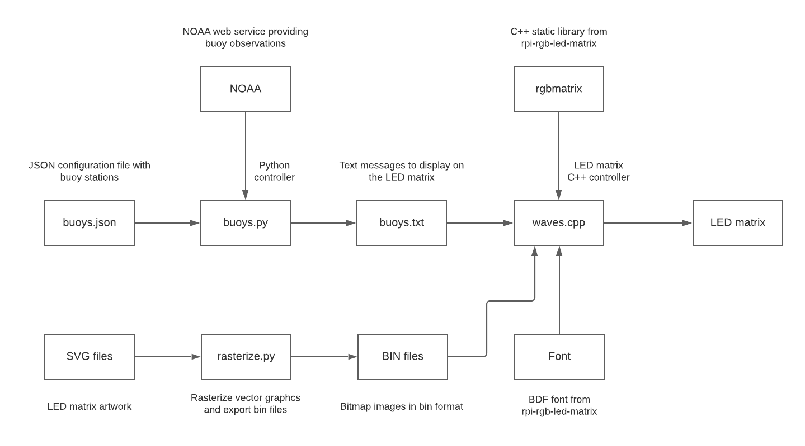

# Overview
Wave Tracker LED Matrix is a desktop digital art piece that displays buoy observation metrics on
an LED matrix. It is be powered by an internet-connected Raspberry Pi Zero W and a 16x32 Adafruit LED matrix.
The system is driven by two separate software modules. First, a C++ program that scrolls an image across
the display using GPIO pins to communicate with the LED matrix. This software is built atop the 
[rpi-rgb-led-matrix](https://github.com/hzeller/rpi-rgb-led-matrix) library.
Second, a Python controller program that downloads buoy observations from NOAA
and produces a text file for the C++ program to consume. 

# Requirements

* Hardware
  * Raspberry Pi Zero W
  * Adafruit 16 x 32 LED Matrix
* Software
  * Raspbian or Raspberry Pi OS
  * Python 3
  * C++ 17
  * [rpi-rgb-led-matrix](https://github.com/hzeller/rpi-rgb-led-matrix)
  
# Data Flow

The diagram below outlines the flow of data between system components.



# This Repo

This repository contains the following:

### Sprite Assets
Raw sprite assets are SVG files and application assets are modeled with 
binary files of the following format consisting of unsigned 8-bit integer segments.

```
[num frames]
for i in 1..{num frames}:
  [width][height]
  for j in 1..{width * height}:
    [r][g][b] 
```

The `rasterize.py` script converts SVG files to bin files.

* `arrows` - 1 green up arrow, 1 red down arrow
* `wave` - 21 crashing wave frames
* `fadein` - 7 water rising frames
* `fadeout` - 6 water falling frames 

### C++ Controller

The `wave.cpp` C++ controller application reads a wave message file at start
up and then endlessly renders the messages on an LED matrix.

### Python Controller 

The `buoys.py` Python controller application reads a buoy station JSON file
at start up and then queries a NOAA web service minutely for recent buoy 
observations. Upon discovering a new observation, the Python controller 
restarts the C++ LED matrix controller.

# Build

Install RPI LED Matrix Library:

Clone the repository and follow the installation instructions.

```shell script
git clone https://github.com/hzeller/rpi-rgb-led-matrix.git
``` 

Install Wave Tracker:

```shell script
git clone https://github.com/ebarlas/wave-tracker-led-matrix.git
cd wave-tracker-led-matrix
make RGB_LIB_DISTRIBUTION=/home/pi/rpi-rgb-led-matrix
```

# Run

### C++ Controller

Run the `wave.cpp` C++ controller application as follows:

```shell script
sudo ./wave <font file> <text file>
```

This is the suggested configuration and the default used by the Python controller:

```shell script
sudo ./wave ../rpi-rgb-led-matrix/fonts/helvR12.bdf buoys.txt
```

### Python Controller

Run the `buoys.py` Python controller application as follows:

```shell script
sudo python3 buoys.py 
```

### Linux Service

Install the app as a service using the steps in the raspberrypi.org systemd [reference document](https://www.raspberrypi.org/documentation/linux/usage/systemd.md).
The `buoys.sh` and `buoys.service` files are included as a convenience.

```shell script
sudo cp buoys.service /etc/systemd/system/
```

```shell script 
sudo systemctl start buoys.service
```

```shell script
sudo systemctl enable buoys.service
```